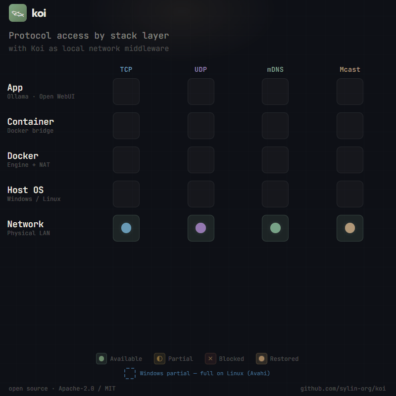

# Koi 𓆝

**The missing LAN toolbox.** Discover services, name them, trust them, serve them —
one cross-platform binary, no accounts, no cloud, works when the internet doesn't.

<p align="center">
  
</p>

Koi runs as a small daemon on each machine and gives your local network the four
things it never gets out of the box, wired together as one pipeline:

| | Pillar | What it means |
| --- | --- | --- |
| 🔎 | **Discover** | mDNS/DNS-SD service discovery with a real lifecycle — services that vanish actually disappear (leases, not ghosts) |
| 🏷️ | **Name** | A local DNS zone where names appear automatically — from discovery, from containers, from certificates |
| 🔐 | **Trust** | A private CA with guided enrollment and OS trust-store installation — HTTPS on the LAN without browser warnings |
| 🛰️ | **Serve** | A zero-config TLS endpoint for those certificates, plus health checks to watch it all |

Label a container, and the pipeline runs end to end: it gets announced, named,
certified, and watched — without touching the image.

Everything is reachable three ways: a **CLI** built for discoverability, an
**HTTP API** with interactive docs, and a **web dashboard** with a live mDNS
network browser.

```bash
koi mdns discover              # what's on this network?
koi dns add grafana 10.0.0.42  # give it a friendly name
koi certmesh create            # mint a private CA (guided)
koi status                     # one view of everything
koi launch                     # open the dashboard
```

Or over HTTP, from any language or script:

```bash
# Reads are open on localhost:
curl "http://localhost:5641/v1/mdns/discover?type=_http._tcp"

# Writes carry the daemon token (the CLI does this for you):
curl -X POST -H "x-koi-token: $TOKEN" http://localhost:5641/v1/mdns/announce \
  -d '{"name": "My App", "type": "_http._tcp", "port": 8080}'
```

The token lives in a breadcrumb file next to the daemon — see the
[security model](docs/reference/security-model.md) for the two-line recipe per OS.

## Quick start

Install with one line (detects your OS/arch, verifies the checksum, puts `koi`
on your `PATH`):

```bash
curl -fsSL https://raw.githubusercontent.com/sylin-org/koi/main/install.sh | sh   # Linux / macOS
```

```powershell
irm https://raw.githubusercontent.com/sylin-org/koi/main/install.ps1 | iex        # Windows
```

Then:

```bash
koi mdns discover        # works instantly, no daemon, no config
```

For the full toolbox, run the daemon — foreground or as a system service:

```bash
koi --daemon             # foreground (Ctrl+C to stop)
sudo koi install         # or: install as a service (Linux/macOS)
```

```powershell
koi install              # Windows (run as Administrator)
```

The daemon listens on `127.0.0.1:5641`. Bare `koi` shows live status plus the full
command catalog; `koi <domain>` shows curated examples; any command + `?`
(e.g. `koi mdns announce?`) opens a detail page.

## Why Koi exists

mDNS is the invisible backbone of local networking. Printers, smart speakers,
AirPlay, Chromecast, IoT devices — everything uses it. But **using** it
programmatically is surprisingly painful:

- **Windows** has native mDNS since Windows 10, but the Win32 APIs are poorly
  documented, 64-bit only, and don't expose full DNS-SD. The alternative — Apple's
  Bonjour — is effectively abandoned, with redistribution-prohibiting licensing.
- **Linux** has Avahi: Linux-only, semi-maintained, deeply coupled to D-Bus and
  systemd. systemd-resolved's mDNS is famously flaky.
- **Containers** can't do mDNS at all — bridge networks don't forward multicast,
  and every workaround (`--network=host`, macvlan, reflectors) sacrifices isolation
  or adds fragility.
- **Cross-platform libraries** exist, but they're libraries: you re-implement
  discovery per language, and then hit the container multicast wall anyway.

And discovery is only the first step. The moment you can *find* services, you want
to *name* them (without hand-editing zone files) and *trust* them (HTTPS on private
addresses, where public CAs are forbidden from issuing — for `.internal` names and
RFC-1918 IPs, a private CA is the only path). Each layer has point solutions; the
wiring between them is what you end up building by hand. **The wiring is what Koi
is.**

## Works with your stack

Koi is the substrate *under* the tools you already run, not a replacement for them:

- **Keep your DNS ad-blocker.** Delegate one zone via conditional forwarding —
  Pi-hole/AdGuard/dnsmasq forward `*.lan` to Koi; everything else stays put.
- **Keep Tailscale.** Point a tailnet split-DNS rule at Koi's resolver and remote
  devices resolve your LAN names; Koi covers the printers, TVs, and guests the
  tailnet can't see.
- **Keep your reverse proxy.** Certmesh certs land as files with reload hooks for
  Caddy/Traefik/NPM today; an ACME endpoint (RFC 8555, dns-01, port 5643) lets your
  proxy renew against Koi like a local Let's Encrypt — see the [ACME guide](docs/guides/acme.md).
- **Ships now:** Prometheus service-discovery export (`GET /v1/sd/prometheus`),
  MCP tools so AI agents can discover and trust local services, and reading the
  `traefik.*` / caddy labels your containers already carry.

The doctrine: export in *their* formats, consume what you already wrote, and make
every capability easy to leave — tools that are easy to stop using are easy to
start using.

## Capabilities

Core pillars:

| Capability | What it does | CLI | Guide |
| --- | --- | --- | --- |
| **mDNS** | Service discovery with lease lifecycle | `koi mdns …` | [mDNS guide](docs/guides/mdns.md) |
| **DNS** | Local resolver; names from three sources | `koi dns …` | [DNS guide](docs/guides/dns.md) |
| **Certmesh** | Private CA, guided enrollment, truststore install | `koi certmesh …` | [Certmesh guide](docs/guides/certmesh.md) |
| **Runtime** | Container lifecycle → announce/name/cert/watch via labels | `--runtime` | [Runtime guide](docs/guides/runtime.md) |

Supporting cast:

| Capability | What it does | CLI | Guide |
| --- | --- | --- | --- |
| **Proxy** | TLS endpoint for certmesh certs | `koi proxy …` | [Proxy guide](docs/guides/proxy.md) |
| **Health** | HTTP/TCP checks feeding status & dashboard | `koi health …` | [Health guide](docs/guides/health.md) |
| **UDP** | Host UDP sockets for bridge-networked containers | `koi udp …` | [UDP guide](docs/guides/udp.md) |
| **Trust** | Install/list/remove CA roots in the OS trust store; export the certmesh root; `koi trust diagnose` is the one-command trust-doctor | `koi trust …` | [Trust protocol](docs/reference/trust-protocol.md) |
| **MCP** | Expose the LAN to AI agents. `koi mcp serve` is the **stdio** transport; the running daemon also serves the same surface over **Streamable HTTP** at `/v1/mcp` (token-authed; default on, `--no-mcp-http` to disable) | `koi mcp serve` | [MCP guide](docs/guides/mcp.md) |
| **ACME** | RFC 8555 server (dns-01, port 5643) so standard clients get certs from the CA | `koi certmesh acme …` | [ACME guide](docs/guides/acme.md) |

Every capability is runtime-toggleable (`--no-dns`, `KOI_NO_DNS=1`, …). The daemon
also exports for tools you already run — a **Prometheus HTTP-SD** endpoint
(`GET /v1/sd/prometheus`) and a **DNS zone export** (`GET /v1/dns/zone?format=hosts|dnsmasq|json`) —
and serves the **dashboard** (`/`), the **mDNS network browser** (`/mdns-browser`),
and **interactive API docs** (`/docs`).

### A trust plane that's never silent

Every node carries a **posture** — Open until it has a mesh identity, mTLS once it
does — and the *same* API behaves the same in both modes: messages can be signed
(verified offline against the mesh root) or sealed, and listeners flip live between
plaintext and mTLS without dropping connections. The category's defining failure is
silent trust state (certs that expire unnoticed, mesh that's secretly plaintext), so
Koi makes it loud: `koi trust diagnose` is the one-command health check — posture,
identity and renewal health, integrity, revocation, CA-trust-install, clock skew, each
with an exact remedy, exiting non-zero on anything red. The language-neutral wire
contract is in the [trust protocol reference](docs/reference/trust-protocol.md).

### Embedding: optional heavy backends

`koi-embedded` ships every backend by default. A lean consumer (e.g. a headless
container that only needs discovery/DNS) can drop the heavy, version-locked ones with a
single line — and re-arm any subset à la carte:

| Cargo feature | Default | Pulls in | Off → fallback |
| --- | --- | --- | --- |
| `docker` | on | `bollard` Docker/Podman client (`=`-pinned stubs) | runtime backend → `BackendUnavailable` |
| `keyring` | on | OS keychain / Secret Service / D-Bus | vault uses its passphrase backend |
| `qr` | on | `qrcode` + `image` PNG codec | enrollment prints the `otpauth://` URI |

```toml
# everything (default) — unchanged
koi-embedded = "0.4"
# lean: no bollard, no OS-keychain/D-Bus, no image codec
koi-embedded = { version = "0.4", default-features = false }
# à la carte
koi-embedded = { version = "0.4", default-features = false, features = ["docker"] }
```

See [ADR-014](docs/adr/014-optional-backend-features.md). The `koi` binary always ships
all backends.

## Containers

Koi's container story — host daemon speaks multicast, containers speak plain HTTP —
is the design center. The HTTP API binds to loopback by default, so it works out of
the box with **Docker Desktop** (`host.docker.internal`); on **native Linux**, expose
it deliberately with `--http-bind bridge` (or `0.0.0.0`) and hand containers the
token with `koi token write` (mutations still require it). [CONTAINERS.md](CONTAINERS.md)
has the patterns, the secure exposure recipe, and the label-driven runtime adapter
(the zero-code path).

OrbStack delivers a similar container-discovery inner loop, but only on macOS and as
proprietary software; Koi is the open-source, cross-platform answer — the same story
on Windows, Linux, and macOS.

## Platform support

| Platform | mDNS engine | Service integration |
| -------- | ----------- | ------------------- |
| Windows | Pure Rust (no Bonjour) | Windows Service (SCM) + firewall rules |
| Linux | Pure Rust (no Avahi) | systemd unit |
| macOS | Pure Rust (no Bonjour) | launchd plist |

Zero OS dependencies, single static binary, and — unusual for this space —
**Windows is a first-class citizen**.

## Installation

**Install script** (recommended) — picks the right release archive for your
OS/arch, verifies its SHA-256, and installs onto your `PATH`. No root needed for
the default per-user location; set `KOI_INSTALL_DIR` or `KOI_VERSION` to override.

```bash
curl -fsSL https://raw.githubusercontent.com/sylin-org/koi/main/install.sh | sh   # Linux / macOS
```

```powershell
irm https://raw.githubusercontent.com/sylin-org/koi/main/install.ps1 | iex        # Windows
```

**Container** — multi-arch (amd64/arm64) image on GHCR:

```bash
docker run --rm ghcr.io/sylin-org/koi:latest version
docker run -d --name koi -p 5641:5641 ghcr.io/sylin-org/koi:latest   # daemon
```

**Prebuilt binaries**: download from
[GitHub Releases](https://github.com/sylin-org/koi/releases), extract, put `koi`
(or `koi.exe`) on your `PATH`.

**crates.io**: `cargo install koi-net` (the package is named `koi-net` — see
[Name](#name) below — and installs a `koi` binary).

**Build from source** — requires [Rust](https://rustup.rs/) 1.92 or later:

```bash
git clone https://github.com/sylin-org/koi.git
cd koi
cargo build --release
```

**Verify** — every release binary and the container image carry a signed
build-provenance attestation. A trust tool should let you verify its own supply
chain in one line:

```bash
gh attestation verify koi-v0.5.1-x86_64-unknown-linux-musl.tar.gz --repo sylin-org/koi
gh attestation verify oci://ghcr.io/sylin-org/koi:0.5.1 --repo sylin-org/koi
```

## Project status

Koi is **pre-1.0, feasibility-validated, and consolidating**. The architecture and
the end-to-end pipeline are real; a thorough June 2026 assessment
([docs/assessment/](docs/assessment/README.md)) mapped what's solid, what's broken,
and what's being cut in the name of *less but more meaningful parts*. The latest
release, **v0.5.1**, makes the trust/identity/posture plane observable over the wire (a
DAT-gated `/v1/events` SSE stream + `/v1/certmesh/posture`, certificate-lifecycle events,
a posture-keyed `reqwest` client, and a CN/role authz hook); v0.5.0 before it added
one-line install, a signed multi-arch container image, a unified serving layer
(`koi-serve`), and security hardening ([CHANGELOG](CHANGELOG.md)). The work plan is public
([docs/prompts/](docs/prompts/README.md)). Expect breaking changes until 1.0 (0.5.1
carries some — see the CHANGELOG and the [upgrade guide](docs/guides/upgrading.md));
don't run it as load-bearing infrastructure yet — do play with it, and file issues when
reality disagrees with the docs.

## Documentation

**Start here:** the [documentation hub](docs/index.md) is the goal-keyed map of every
guide and reference. New to Koi? The [Getting started](docs/tutorials/getting-started.md)
tutorial goes from install to a visible result in about a minute, and
[Trusted HTTPS across two machines](docs/tutorials/trusted-https.md) is the headline
end-to-end journey.

**Using Koi:** [User Guide](GUIDE.md) ·
[Container Guide](CONTAINERS.md) ·
[Security model](docs/reference/security-model.md)

**Capability deep-dives:** [mDNS](docs/guides/mdns.md) ·
[DNS](docs/guides/dns.md) · [DNS coexistence](docs/guides/dns-coexistence.md) ·
[Certmesh](docs/guides/certmesh.md) · [ACME](docs/guides/acme.md) ·
[Runtime](docs/guides/runtime.md) · [Proxy](docs/guides/proxy.md) ·
[Health](docs/guides/health.md) · [UDP](docs/guides/udp.md) ·
[MCP](docs/guides/mcp.md) · [Integrations](docs/guides/integrations.md) ·
[System](docs/guides/system.md) · [Embedded (Rust)](docs/guides/embedded.md)

**For AI agents:** `koi mcp serve` runs a [Model Context Protocol](docs/guides/mcp.md)
server over stdio (the daemon also serves the same surface over Streamable HTTP at
`/v1/mcp`, token-authed), turning the LAN into a substrate an agent can read and act on —
discover services, resolve and add names, take inventory, and announce the agent's
own service (auto-heartbeated, auto-retracted on exit). See the [MCP guide](docs/guides/mcp.md)
for the copy-paste client config.

**Reference:** [Architecture](docs/reference/architecture.md) ·
[HTTP API](docs/reference/http-api.md) · [CLI](docs/reference/cli.md) ·
[Wire protocol](docs/reference/wire-protocol.md) ·
[Ceremony protocol](docs/reference/ceremony-protocol.md) ·
[Envelope encryption](docs/reference/envelope-encryption.md)

**Decisions & direction:** [ADRs](docs/adr/) ·
[Assessment & roadmap](docs/assessment/README.md)

## Name

Koi (鯉) are the fish that live in garden ponds. They're visible — they surface,
they announce themselves by simply existing. You look into the pond and see what's
there. That's service discovery: the network is the pond, the services are the koi.

The binary is `koi`. The crates.io package is `koi-net` because `koi` was taken.

## Acknowledgments

Koi's mDNS heavy lifting happens in
[mdns-sd](https://github.com/keepsimple1/mdns-sd), a pure-Rust mDNS/DNS-SD
implementation by [@keepsimple1](https://github.com/keepsimple1) — probing,
conflict resolution, known-answer suppression, goodbye packets, and all the
multicast plumbing. Koi gives it a friendly front door and builds the naming and
trust layers on top.

## License

Dual licensed under Apache-2.0 and MIT. See [LICENSE-APACHE](LICENSE-APACHE) and
[LICENSE-MIT](LICENSE-MIT). Free to use, embed, bundle, and redistribute,
commercially or otherwise — just link back to this project somewhere reasonable.

## Contributing

See [CONTRIBUTING.md](CONTRIBUTING.md) — including how AI-assisted sessions should
work in this repo (we eat our own dog food: see
[docs/prompts/CHARTER.md](docs/prompts/CHARTER.md)).
