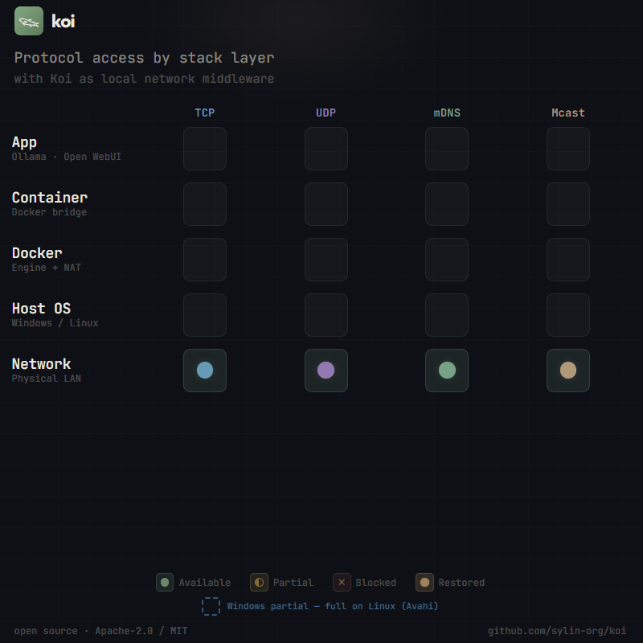

# Koi 𓆝

### Let everything local find, trust, and talk.

Koi makes containers, applications, and devices delightfully discoverable, secure,
and interconnected on your private network.

Bring container workloads onto mDNS. Give services meaningful `.internal` names.
Establish shared identity and trust. Connect applications across container, host, and
device boundaries. Observe them as they arrive, change, and leave.

One open-source, cross-platform binary. No hosted control plane. Built to work with
the tools and networks you already have — even when the internet is unavailable.

<p align="center">
  
</p>

Koi's promise has three parts:

| | Outcome | What it means |
| --- | --- | --- |
| 🔎 | **Find** | Discover services over mDNS/DNS-SD, give them stable `.internal` names, and keep the view honest through leases and lifecycle events |
| 🔐 | **Trust** | Give local names and peers shared identity through a private CA, guided enrollment, OS trust-store installation, mTLS, and diagnosis |
| 🔗 | **Connect** | Let containers, host applications, devices, proxies, resolvers, monitors, and agents participate across their usual network boundaries |

Label a container and Koi can announce, name, certify, and watch it without touching
the image. A container can also discover and watch LAN services through ordinary HTTP,
or bridge UDP without giving up network isolation. Participation works both ways.

Everything is reachable three ways: a **CLI** built for discoverability, an
**HTTP API** with interactive docs, and a **web dashboard** with a live mDNS
network browser.

```bash
koi mdns discover              # what's on this network?
koi dns add grafana 10.0.0.42  # give it a friendly name
koi certmesh create            # mint a private CA (guided)
koi status                     # one view of everything
koi launch                     # open the dashboard
```

Or over HTTP, from any language or script:

```bash
# Reads are open on localhost:
curl "http://localhost:5641/v1/mdns/discover?type=_http._tcp"

# Writes carry the daemon token (the CLI does this for you):
curl -X POST -H "x-koi-token: $TOKEN" http://localhost:5641/v1/mdns/announce \
  -d '{"name": "My App", "type": "_http._tcp", "port": 8080}'
```

The token lives in a breadcrumb file next to the daemon — see the
[security model](docs/reference/security-model.md) for the two-line recipe per OS.

## Quick start

Install with one line (detects your OS/arch, verifies the checksum, puts `koi`
on your `PATH`):

```bash
curl -fsSL https://raw.githubusercontent.com/sylin-org/koi/main/install.sh | sh   # Linux / macOS
```

```powershell
irm https://raw.githubusercontent.com/sylin-org/koi/main/install.ps1 | iex        # Windows
```

Then:

```bash
koi --standalone mdns discover  # intentional one-shot session, no daemon or config
```

For always-on naming, trust, connectivity, and observation, run the daemon —
foreground or as a system service:

```bash
koi --daemon             # foreground (Ctrl+C to stop)
sudo koi install         # or: install as a service (Linux/macOS)
```

```powershell
koi install              # Windows (run as Administrator)
```

The daemon listens on `127.0.0.1:5641`. Bare `koi` shows live status plus the full
command catalog; `koi <domain>` shows curated examples; any command + `?`
(e.g. `koi mdns announce?`) opens a detail page.

## Why Koi exists

Koi began as an mDNS bridge for containers. Containers live on the network, but their
default bridge networks do not carry multicast, so they cannot naturally see or join
the local discovery fabric. A small host service could speak mDNS on the physical LAN
and expose it to isolated workloads through ordinary interfaces.

That solved the first gap and exposed the rest. A workload that can be found still
needs a useful name. A named service still needs identity and trust. Containers,
applications, and devices still need practical ways to communicate across their
boundaries, and the entire picture has to change when something arrives, becomes
unhealthy, or leaves.

mDNS itself illustrates why those seams exist. It is the invisible backbone of local
networking — printers, smart speakers, AirPlay, Chromecast, and IoT devices use it —
but using it programmatically is surprisingly painful:

- **Windows** has official Win32 mDNS/DNS-SD APIs, but the application and operator
  experience around them is unevenly documented and lacks a dependable,
  language-neutral control plane. Apple's Bonjour distribution is not a modern
  foundation for Windows applications.
- **Linux** has Avahi: Linux-only, semi-maintained, deeply coupled to D-Bus and
  systemd. systemd-resolved's mDNS is famously flaky.
- **Containers** can't do mDNS at all — bridge networks don't forward multicast,
  and every workaround (`--network=host`, macvlan, reflectors) sacrifices isolation
  or adds fragility.
- **Cross-platform libraries** exist, but they're libraries: you re-implement
  discovery per language, and then hit the container multicast wall anyway.

Point solutions exist for most individual layers. The unowned problem is the connective
tissue: letting a participant arrive, receive a name, be discovered, be reached, be
trusted, report health, change, and leave cleanly. Koi owns those seams once, at the
host and network boundaries, so every container and application does not have to solve
them again.

## Works with your stack

Koi is the substrate *under* the tools you already run, not a replacement for them:

- **Keep your DNS ad-blocker.** Delegate one zone via conditional forwarding —
  Pi-hole/AdGuard/dnsmasq forward `*.internal` to Koi; everything else stays put.
- **Keep Tailscale.** Point a tailnet split-DNS rule at Koi's resolver and remote
  devices resolve your LAN names; Koi covers the printers, TVs, and guests the
  tailnet can't see.
- **Keep your reverse proxy.** Certmesh certs land as files with reload hooks for
  Caddy/Traefik/NPM today; an ACME endpoint (RFC 8555, dns-01, port 5643) lets your
  proxy renew against Koi like a local Let's Encrypt — see the [ACME guide](docs/guides/acme.md).
- **Ships now:** Prometheus service-discovery export (`GET /v1/sd/prometheus`),
  MCP tools so AI agents can discover and trust local services, and reading the
  `traefik.*` / caddy labels your containers already carry.

The doctrine: export in *their* formats, consume what you already wrote, and make
every capability easy to leave — tools that are easy to stop using are easy to
start using.

## How Koi delivers the outcomes

Find, Trust, and Connect are the product model. The implementation is a set of focused
domains that compose at the daemon boundary:

Foundation:

| Capability | What it does | CLI | Guide |
| --- | --- | --- | --- |
| **mDNS** | Service discovery with lease lifecycle | `koi mdns …` | [mDNS guide](docs/guides/mdns.md) |
| **DNS** | Local resolver; names from three sources | `koi dns …` | [DNS guide](docs/guides/dns.md) |
| **Certmesh** | Private CA, guided enrollment, truststore install | `koi certmesh …` | [Certmesh guide](docs/guides/certmesh.md) |
| **Runtime** | Container lifecycle → announce/name/cert/watch via labels | `--runtime` | [Runtime guide](docs/guides/runtime.md) |

Connectivity and operations:

| Capability | What it does | CLI | Guide |
| --- | --- | --- | --- |
| **Proxy** | TLS endpoint for certmesh certs | `koi proxy …` | [Proxy guide](docs/guides/proxy.md) |
| **Health** | HTTP/TCP checks feeding status & dashboard | `koi health …` | [Health guide](docs/guides/health.md) |
| **UDP** | Host UDP sockets for bridge-networked containers | `koi udp …` | [UDP guide](docs/guides/udp.md) |
| **Trust** | Install/list/remove CA roots in the OS trust store; export the certmesh root; `koi trust diagnose` is the one-command trust-doctor | `koi trust …` | [Trust protocol](docs/reference/trust-protocol.md) |
| **MCP** | Expose the LAN to AI agents. `koi mcp serve` is the **stdio** transport; the running daemon also serves the same surface over **Streamable HTTP** at `/v1/mcp` (token-authed; default on, `--no-mcp-http` to disable) | `koi mcp serve` | [MCP guide](docs/guides/mcp.md) |
| **ACME** | RFC 8555 server (dns-01, port 5643) so standard clients get certs from the CA | `koi certmesh acme …` | [ACME guide](docs/guides/acme.md) |

Every capability is runtime-toggleable (`--no-dns`, `KOI_NO_DNS=1`, …). The daemon
also exports for tools you already run — a **Prometheus HTTP-SD** endpoint
(`GET /v1/sd/prometheus`) and a **DNS zone export** (`GET /v1/dns/zone?format=hosts|dnsmasq|json`) —
and serves the **dashboard** (`/`), the **mDNS network browser** (`/mdns-browser`),
and **interactive API docs** (`/docs`).

### A trust plane that's never silent

Every node carries a **posture** — Open until it has a mesh identity, mTLS once it
does — and the *same* API behaves the same in both modes: messages can be signed
(verified offline against the mesh root) or sealed, and listeners flip live between
plaintext and mTLS without dropping connections. The category's defining failure is
silent trust state (certs that expire unnoticed, mesh that's secretly plaintext), so
Koi makes it loud: `koi trust diagnose` is the one-command health check — posture,
identity and renewal health, integrity, revocation, CA-trust-install, clock skew, each
with an exact remedy, exiting non-zero on anything red. The language-neutral wire
contract is in the [trust protocol reference](docs/reference/trust-protocol.md).

### Embedding: optional heavy backends

`koi-embedded` ships every backend by default. A lean consumer (e.g. a headless
container that only needs discovery/DNS) can drop the heavy, version-locked ones with a
single line — and re-arm any subset à la carte. The snippets below target `1.0.0-rc.2`,
the last published prerelease; repository source is now on the `1.0.0-dev.0`
architecture-development line:

| Cargo feature | Default | Pulls in | Off → fallback |
| --- | --- | --- | --- |
| `docker` | on | `bollard` Docker/Podman client (`=`-pinned stubs) | runtime backend → `BackendUnavailable` |
| `keyring` | on | OS keychain / Linux Secret Service | vault uses its passphrase backend |
| `qr` | on | `qrcode` + `image` PNG codec | enrollment prints the `otpauth://` URI |

```toml
# everything (default) — unchanged
koi-embedded = "1.0.0-rc.2"
# lean: no bollard, no OS-keychain/Secret Service, no image codec
koi-embedded = { version = "1.0.0-rc.2", default-features = false }
# à la carte
koi-embedded = { version = "1.0.0-rc.2", default-features = false, features = ["docker"] }
```

Linux mDNS provider adapters and their small `zbus` client remain in lean builds; they
are required platform integration, not part of the optional keyring closure. See
[ADR-014](docs/adr/014-optional-backend-features.md). The `koi` binary always ships all
backends.

## Containers

Koi's container story — host daemon speaks multicast, containers speak plain HTTP —
is the design center. The HTTP API binds to loopback by default, so it works out of
the box with **Docker Desktop** (`host.docker.internal`); on **native Linux**, expose
it deliberately with `--http-bind bridge` (or `0.0.0.0`) and hand containers the
token with `koi token write` (mutations still require it). [CONTAINERS.md](CONTAINERS.md)
has the patterns, the secure exposure recipe, and the label-driven runtime adapter
(the zero-code path).

OrbStack delivers a similar container-discovery inner loop, but only on macOS and as
proprietary software; Koi is the open-source, cross-platform answer — the same story
on Windows, Linux, and macOS.

## Platform support

| Platform | mDNS engine | Service integration |
| -------- | ----------- | ------------------- |
| Windows | Built-in native publication (including explicit addresses); official Windows DNS-SD browse/resolve; Bonjour only when its service and client library are genuinely installed and running | Windows Service (SCM) + program-scoped firewall rules, including the separately armed Pond listener |
| Linux | Capability-routed Avahi, systemd-resolved, and built-in native providers | systemd unit or OpenRC `supervise-daemon` |
| macOS | Built-in native provider | launchd LaunchDaemon |

One binary continuously uses the best live platform capabilities, without requiring
Avahi or Bonjour to be installed. Native Koi is always catalogued as the lowest-priority
provider and — unusual for this space — **Windows is a first-class citizen**.
Provider names are not capability claims: on current Windows, the official DNS-SD
adapter owns read routes while native Koi owns publication because physical peer probes
showed that Windows registrations were not answered off-box. `koi mdns admin status
--json` reports the exact live route owners and why a candidate was or was not selected.

## Installation

**Install script** (recommended) — picks the right release archive for your
OS/arch, verifies its SHA-256, and installs onto your `PATH`. No root needed for
the default per-user location; set `KOI_INSTALL_DIR` or `KOI_VERSION` to override.

```bash
curl -fsSL https://raw.githubusercontent.com/sylin-org/koi/main/install.sh | sh   # Linux / macOS
```

```powershell
irm https://raw.githubusercontent.com/sylin-org/koi/main/install.ps1 | iex        # Windows
```

**Container** — multi-arch (amd64/arm64) image on GHCR:

```bash
docker run --rm ghcr.io/sylin-org/koi:latest version
docker run -d --name koi -p 5641:5641 ghcr.io/sylin-org/koi:latest   # daemon
```

**Prebuilt binaries**: download from
[GitHub Releases](https://github.com/sylin-org/koi/releases), extract, put `koi`
(or `koi.exe`) on your `PATH`.

**crates.io**: `cargo install koi-net` remains the source-build escape hatch (the
package is named `koi-net` — see [Name](#name) below — and installs a `koi`
binary). It needs a Rust toolchain; the recommended installer above does not.

The published v1 release-candidate line carries an artifact manifest and `cargo-binstall`
metadata, so Rust users can install the official prebuilt archive without compiling.
Prereleases are deliberately explicit: the last published candidate is installed with
`cargo binstall koi-net --version 1.0.0-rc.2` or
`npx @sylin-org/koi@1.0.0-rc.2`. Stable unqualified commands remain on the latest stable
release; development source is not presented as a release artifact.
See [ADR-025](docs/adr/025-release-channels-and-bootstrap-contract.md) for the
artifact-first channel contract and its deliberately honest rollout states.

**Build from source** — requires [Rust](https://rustup.rs/) 1.92 or later:

```bash
git clone https://github.com/sylin-org/koi.git
cd koi
cargo build --release
```

**Verify the last published candidate** — every release binary and the container image carry a signed
build-provenance attestation. A trust tool should let you verify its own supply
chain in one line:

```bash
gh attestation verify koi-v1.0.0-rc.2-x86_64-unknown-linux-musl.tar.gz --repo sylin-org/koi
gh attestation verify oci://ghcr.io/sylin-org/koi:1.0.0-rc.2 --repo sylin-org/koi
```

## Project status

Koi source is at **v1.0.0-dev.0**, an active architecture-development line. The former
`v1.0.0-rc.2` candidate remains the last published prerelease, but its freeze has been
withdrawn for current source while [observable domain boundaries](docs/adr/043-observable-domain-boundaries.md)
are implemented and validated. Current `dev` is not a release candidate or a stable declaration.

The accepted rc.2 and fleet records remain evidence for the exact artifacts they tested; they
are not being rewritten as proof for this development line. A new candidate requires fresh
repository validation and an explicit physical-validation dispatch. To use the published
candidate, pin `1.0.0-rc.2` and read the [upgrade guide](docs/guides/upgrading.md). The
assessment and historical validation record remain public under
[docs/assessment/](docs/assessment/README.md) and [docs/prompts/](docs/prompts/README.md).

## Documentation

**Start here:** the [documentation hub](docs/index.md) is the goal-keyed map of every
guide and reference. New to Koi? The [Getting started](docs/tutorials/getting-started.md)
tutorial goes from install to a visible result in about a minute, and
[Trusted HTTPS across two machines](docs/tutorials/trusted-https.md) is the headline
end-to-end journey.

**Using Koi:** [User Guide](GUIDE.md) ·
[Container Guide](CONTAINERS.md) ·
[Security model](docs/reference/security-model.md)

**Capability deep-dives:** [mDNS](docs/guides/mdns.md) ·
[DNS](docs/guides/dns.md) · [DNS coexistence](docs/guides/dns-coexistence.md) ·
[Certmesh](docs/guides/certmesh.md) · [ACME](docs/guides/acme.md) ·
[Runtime](docs/guides/runtime.md) · [Proxy](docs/guides/proxy.md) ·
[Health](docs/guides/health.md) · [UDP](docs/guides/udp.md) ·
[MCP](docs/guides/mcp.md) · [Integrations](docs/guides/integrations.md) ·
[System](docs/guides/system.md) · [Embedded (Rust)](docs/guides/embedded.md)

**For AI agents:** `koi mcp serve` runs a [Model Context Protocol](docs/guides/mcp.md)
server over stdio (the daemon also serves the same surface over Streamable HTTP at
`/v1/mcp`, token-authed), turning the LAN into a substrate an agent can read and act on —
discover services, resolve and add names, take inventory, and announce the agent's
own service (auto-heartbeated, auto-retracted on exit). See the [MCP guide](docs/guides/mcp.md)
for the copy-paste client config.

**Reference:** [Architecture](docs/reference/architecture.md) ·
[HTTP API](docs/reference/http-api.md) · [CLI](docs/reference/cli.md) ·
[Wire protocol](docs/reference/wire-protocol.md) ·
[Ceremony protocol](docs/reference/ceremony-protocol.md) ·
[Envelope encryption](docs/reference/envelope-encryption.md)

**Decisions & direction:** [Find, Trust, Connect](docs/adr/024-public-identity-find-trust-connect.md) ·
[Release channels](docs/adr/025-release-channels-and-bootstrap-contract.md) ·
[Observable domain boundaries](docs/adr/043-observable-domain-boundaries.md) ·
[All ADRs](docs/adr/) ·
[Assessment & roadmap](docs/assessment/README.md)

## Name

Koi (鯉) are the fish that live in garden ponds. They're visible — they surface,
they announce themselves by simply existing. You look into the pond and see what's
there. That was the original service-discovery idea: the network is the pond, the
services are the koi. The project grew beyond seeing what is there, but the name still
fits its purpose—helping everything in the local environment participate rather than
remain hidden behind a boundary.

The binary is `koi`. The crates.io package is `koi-net` because `koi` was taken.

## Acknowledgments

Koi's built-in mDNS provider uses
[mdns-sd](https://github.com/keepsimple1/mdns-sd), a pure-Rust mDNS/DNS-SD
implementation by [@keepsimple1](https://github.com/keepsimple1). On Linux, Koi
can use [Avahi](https://avahi.org/) and systemd-resolved through their native D-Bus
APIs. Koi's capability-aware supervisor gives every provider the same friendly
front door, composes only non-overlapping operations, and builds the naming and
trust layers on top.

## Code signing policy

Windows release executables are prepared for Authenticode signing through SignPath Foundation.
The signing scope, release controls, privacy boundary, system changes, removal instructions, and
verification steps live in the [Code signing policy](CODE_SIGNING_POLICY.md).

Free code signing provided by [SignPath.io](https://about.signpath.io/), certificate by
[SignPath Foundation](https://signpath.org/).

## License

Dual licensed under Apache-2.0 and MIT. See [LICENSE-APACHE](LICENSE-APACHE) and
[LICENSE-MIT](LICENSE-MIT). Free to use, embed, bundle, and redistribute,
commercially or otherwise — just link back to this project somewhere reasonable.

## Contributing

See [CONTRIBUTING.md](CONTRIBUTING.md) — including how AI-assisted sessions should
work in this repo (we eat our own dog food: see
[docs/prompts/CHARTER.md](docs/prompts/CHARTER.md)).
