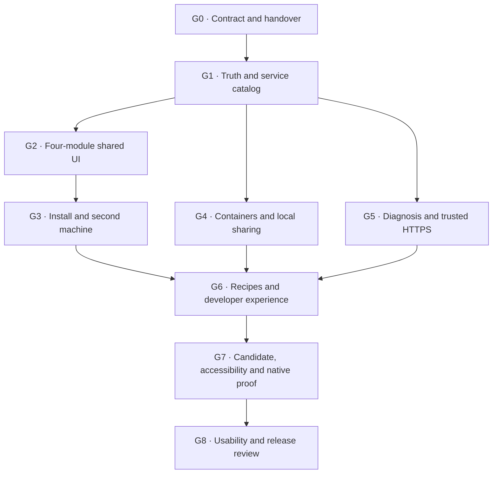

# Epic 003 - Realign Koi around user delight

- **Status:** execution authorized on Linux; R01 contract complete, handover pending one Windows process-restoration check.
- **Opened:** 2026-09-04.
- **Owner intent:** a comprehensive realignment of code, installation, product
  experience, documentation and contributor/release quality before the next 1.0 candidate.
- **Execution entry:** [fleet/task.md](../task.md) -> [Linux dispatch](../delight-dispatch.md) -> [prompt pack](../../docs/prompts/delight/README.md).
- **Progress authority:** [LEDGER.md](../../docs/prompts/delight/LEDGER.md).
- **Implementation gate:** R01 acceptance; finish/reconcile the inherited Epic 002 native run before product work.

## Outcome

Koi becomes the everyday place to find, use and deliberately share local services.
The first installation delivers something useful. A second machine participates
automatically. An opted-in container appears when its application is ready. A local
Ollama can be shared through one understandable action. Secure setup delivers a URL
that the intended second client actually resolves and trusts. Failures explain
the next useful action; normal operation stays quiet.

This is product acceptance work. A prettier UI alone cannot close this epic.
Implementation, native behavior, documentation, and observed user comprehension
all contribute to the exit verdict.

## Authority and handover

On 2026-09-04 the owner delegated execution to the Linux machines through
`fleet/task.md`. The dispatcher and fixed ledger assignments are active for that
delegation. R01 contract preparation is the first assignment; implementation is
not started or accepted by this wiring change.

R01 records the actual Epic 002 disposition: finished with verified restoration,
or explicitly superseded by the operator with verified restoration. No new
product implementation/deployment proceeds before R01 acceptance. An existing
native run keeps its frozen artifact and peer reservations until cleanup is proved.
Do not infer completion from its scheduled end time or cancel it implicitly.

Follow [the Linux dispatch](../delight-dispatch.md) for ownership, claims, peers
and direct dev publication. The R charter governs bounded repository work; native
work keeps the existing own-host protocol. The new dispatch supersedes historical
PH selection, not historical evidence. No second backend or per-host prompt tree
is introduced.

Linux may implement portable and Windows-specific source. Missing Windows physical
evidence stays explicit under the ledger's narrow Linux readiness rule. Full task,
gate and release acceptance retains the entire native matrix. Windows execution
requires its own subsequent operator dispatch; Linux does not launch that hat.

Historical green evidence remains valid only for its recorded source/artifacts.
Product, dependency, recipe or asset changes require a new identity and affected
revalidation; none of the previous candidate's acceptance transfers automatically.

## Requirements

The following are the owner's mandates, preserved across all work orders:

- Recommended install ends with a usable product and sane defaults. Desktop setup
  owns the compatible daemon/workbench combination and background startup.
- Installing another machine on the supported shared network automatically enables
  mDNS participation, reusing capable native support and filling missing capability.
- Services are easy to recognize and open even if a user forgot their names.
  Device, service and connection are the everyday concepts.
- Rust remains the application/platform foundation for portability. Renderer choice
  must prove the native lifecycle, supported Linux libc and headless web paths.
- Retain the source Sylin language: dark night-garden appearance, existing diagram
  grammar, lamp/status band and top Home/Devices/Settings/About buttons. Keep Koi's
  original artwork and full collectible mascot card on About.
- Advanced users can reach raw records, comparisons, DNS, certificate/audit data,
  health, proxy, UDP, runtime and automation without a forced novice wizard.
- One announce shorthand on a container participates automatically as the app becomes
  usable. No fictitious readiness or workload certificate promise.
- Detect useful local offerings and offer deliberate sharing with a real name,
  reachable endpoint, scoped native access and reversible Koi-owned changes.
- Break-and-rebuild is allowed for interfaces, packaging and implementation.
  Preserve or explicitly migrate durable user settings, favorites and trust/identity
  material. Frozen protocol labels and architectural authority do not become disposable.

The final mandates override earlier recommendations to preserve the old pages or
limit work to incremental fixes. They also override the June prompt stash's advice
that durable state needs no migration.

## Users and success

| User/job | What the epic must deliver | Proof |
|---|---|---|
| Newcomer | Install, recognize and open a useful service | Fresh install and an uncoached task |
| Homelab operator | Find a forgotten app; share local Ollama; stop sharing cleanly | Actual peer call and restored local-only path |
| Container developer | One shorthand, correct readiness and lifecycle, a usable endpoint | Real Docker/Podman fixture and independent peer |
| Person on another device | Services appear; selected HTTPS works in the named client | Resolution and normal certificate validation on that client |
| Operator handling a failure | URL diagnosis, concrete deadline, tested recovery | Broken-then-fixed fixture and recovery receipt |
| Automation/agent builder | Coherent service IDs, typed state and permitted actions | CLI/API/SDK/MCP compatibility cases |
| Rust embedder | Reuse lifecycle without an installed daemon dependency | External lean example and orderly shutdown |
| Contributor | Find current work, make one bounded change, run relevant gates | Fresh contributor task and truthful indexes |

## Architectural boundaries

Keep ADR-043's commands, immutable current state and best-effort events distinct.
The service catalog projects domain-owned state; it does not replace domain truth.
Cross-domain coordination has one explicit owner in koi-compose. Transports remain
in koi-serve. Native sharing/installation resources keep durable intent, scoped
ownership, recovery and joinable lifetimes. UI closure cannot abandon an admitted
operation. Clients never reconstruct truth from the events they happened to receive.

R01 fixes module/type/route ownership and example shapes once in
[CONTRACT.md](../../docs/prompts/delight/CONTRACT.md). R06 fixes the renderer, component,
asset and build map once. Later prompts consume these contracts instead of making
independent architecture decisions. Actual implementation can amend a contract
with rationale and affected dependent retests.

The shared UI provides the permitted surface for each caller. A read-only Pond
view never inherits local operator mutations. Seeing a service does not grant
authority; joining a mesh does not prove a browser trusts a leaf; firewall access
does not prove application authentication.

Use the real CSS dictionary and original asset provenance. Source values are the
family starting point; critical text/focus/target accessibility can use stronger
family tokens and spacing. Unreadable tiny labels are not product identity.

## Workstreams and sequence

The table below carries exact task dependencies; the diagram summarizes outcomes.
R28 CI work can start after R01 and does not wait for feature completion. R29 must
rerun the complete final candidate pipeline. Independent tasks may be worked in
separate explicitly coordinated sessions, but this pack does not instruct an agent
to spawn workers or race on shared files.

| Prompt | Bounded mission | Dependencies | Gate |
|---|---|---|---|
| [R01](../../docs/prompts/delight/R01-contract-and-handover.md) | Set the product contract and campaign handover | - | G0 |
| [R02](../../docs/prompts/delight/R02-critical-documentation-truth.md) | Correct high-consequence claims and pin their contracts | R01 | G1 |
| [R03](../../docs/prompts/delight/R03-discovery-record-correctness.md) | Fix discovery classification at its source | R01 | G1 |
| [R04](../../docs/prompts/delight/R04-service-catalog.md) | Build the authoritative service catalog projection | R01, R03 | G1 |
| [R05](../../docs/prompts/delight/R05-catalog-api-and-preferences.md) | Expose the catalog and durable personal preferences | R04 | G1 |
| [R06](../../docs/prompts/delight/R06-rust-ui-and-family-foundation.md) | Choose and build the Rust UI foundation with Sylin assets | R01, R05 | G2 |
| [R07](../../docs/prompts/delight/R07-home-launchpad.md) | Build Home as the service launchpad | R05, R06 | G2 |
| [R08](../../docs/prompts/delight/R08-devices-and-comparison.md) | Make Devices answer where services run | R07 | G2 |
| [R09](../../docs/prompts/delight/R09-settings-about-and-surface-consolidation.md) | Consolidate Settings, About, advanced tools and Pond | R08 | G2 |
| [R10](../../docs/prompts/delight/R10-meaningful-activity.md) | Make changes, favorites and notifications useful | R07 | G2 |
| [R11](../../docs/prompts/delight/R11-installation-contract.md) | Make installation a durable path to a working Koi | R01, R06 | G3 |
| [R12](../../docs/prompts/delight/R12-windows-installation.md) | Complete the Windows install and lifecycle journey | R11, R09 | G3 |
| [R13](../../docs/prompts/delight/R13-linux-installation.md) | Complete one Linux installation recipe per execution | R11, R09 | G3 |
| [R14](../../docs/prompts/delight/R14-automatic-second-machine.md) | Prove automatic second-machine discovery and recovery | R03, R07, R12, R13 | G3 |
| [R15](../../docs/prompts/delight/R15-container-ready-service.md) | Make an opted-in container become one usable service | R05, R07, R11 | G4 |
| [R16](../../docs/prompts/delight/R16-local-service-detection.md) | Detect useful services already running on this machine | R04, R11 | G4 |
| [R17](../../docs/prompts/delight/R17-reversible-service-sharing.md) | Own publication, routing and firewall changes as one share | R05, R11, R16 | G4 |
| [R18](../../docs/prompts/delight/R18-share-service-experience.md) | Deliver the local discovery to Share experience | R07, R16, R17 | G4 |
| [R19](../../docs/prompts/delight/R19-url-diagnosis.md) | Explain why a specific service URL fails | R04, R07 | G5 |
| [R20](../../docs/prompts/delight/R20-authorized-service-certificates.md) | Give a service the right name and authorized certificate | R01, R04 | G5 |
| [R21](../../docs/prompts/delight/R21-secure-service-operation.md) | Compose names, certificates and routing into secure access | R11, R19, R20 | G5 |
| [R22](../../docs/prompts/delight/R22-secure-access-and-client-onboarding.md) | Guide users from a service to verified HTTPS | R07, R15, R21 | G5 |
| [R23](../../docs/prompts/delight/R23-renewal-and-recovery.md) | Make renewal and recovery understandable and dependable | R21, R22 | G5 |
| [R24](../../docs/prompts/delight/R24-finished-acme-integration.md) | Finish one maintained external-proxy integration | R20, R22 | G6 |
| [R25](../../docs/prompts/delight/R25-developer-and-agent-experience.md) | Align CLI, SDK, MCP and embedding with service tasks | R05, R17, R19, R21 | G6 |
| [R26](../../docs/prompts/delight/R26-documentation-and-contributor-path.md) | Make documentation and contribution paths follow user goals | R02, R09, R14, R15, R18, R22, R23, R24, R25 | G6 |
| [R27](../../docs/prompts/delight/R27-accessibility-and-interaction-proof.md) | Prove the real UI is usable with keyboard, touch and interruption | R09, R10, R18, R22 | G7 |
| [R28](../../docs/prompts/delight/R28-ci-and-release-contracts.md) | Make routine CI validate the actual development and candidate tree | R01 | G7 |
| [R29](../../docs/prompts/delight/R29-candidate-fleet-acceptance.md) | Validate one exact realignment candidate across the native fleet | R02, R03, R09, R10, R12, R13, R14, R15, R18, R23, R24, R25, R26, R27, R28 | G7 |
| [R30](../../docs/prompts/delight/R30-usability-and-release-review.md) | Evaluate delight with real users and close the epic honestly | R29 | G8 |

Fleet execution selects the fixed owner's earliest dependency-ready task, one
slice per iteration. The ledger defines ownership, internal order and the narrow
Linux-only dependency exception for outstanding Windows physical evidence.
Implemented and accepted remain distinct; no missing source contract, Linux test,
security check or final native/release requirement is waived.

## Gate definitions

| Gate | Exit condition | Required evidence |
|---|---|---|
| G0 | One active campaign and concrete product/owner contracts | R01 ADR, source maps, activation/old-campaign disposition |
| G1 | Critical claims corrected, discovery types sound, one service catalog and durable preferences | R02-R05 positive/negative contracts, stored-data migration |
| G2 | Four coherent modules and useful activity, one shared presentation across permitted surfaces | R06-R10 actual UI/route coverage, original card, state/authority checks |
| G3 | Recommended install works on supported native paths; second machine participates automatically | R11-R14 Windows, glibc, musl, immutable and headless installed-product evidence |
| G4 | Opted-in container and explicitly shared local HTTP/API service work from another machine | R15-R18 readiness, alias resolution, routing/firewall scope and stop/restoration |
| G5 | Diagnosis, authorized service certificate, guided secure URL and recovery work together | R19-R23 normal second-client TLS, invalid caller/fingerprint, restart/renewal/recovery |
| G6 | One external proxy integration, consistent developer surfaces and goal-oriented docs | R24-R26 executed recipes and named version/transport compatibility |
| G7 | Real accessibility and exact-candidate hosted/native acceptance | R27-R29 interaction checks, hashes, physical matrix, soak/restoration |
| G8 | Actual users complete the core tasks and the release report is truthful | R30 uncoached task results, finding disposition and concrete release notes |

All gates are required for this epic. R01 may surface a proposed scope adjustment,
but a smaller executor cannot drop a gate, call a feature 'later', or replace a
native requirement with a mock simply to finish. Changes to the owner-approved
scope must be explicit and recorded.

## Target acceptance journeys

1. **Install and open:** a fresh supported desktop installs the compatible product,
   starts background participation, displays existing services and opens a real one.
   No extra daemon command, provider choice or protocol reading. Headless install
   supplies the equivalent running service and usable operator entry.
2. **Second machine:** B sees expected services and A sees B automatically. Check both
   directions through installed products. Discovery works before any mesh enrollment.
   Closed UI does not stop participation.
3. **Container:** run the copyable fixture with announce shorthand. Starting is
   distinct from app readiness. Open reaches the real app from B. Restart/recreate
   and withdrawal converge without duplicate identities or orphaned derived resources.
4. **Local sharing:** detect a loopback-only API, show its evidence and access scope,
   accept the sensible proposed name, Share, then resolve and call it from B.
   Restart Koi, repeat access, Stop sharing, verify local access remains and the
   Koi-owned remote path is gone. Foreign pre-existing access is reported accurately.
5. **Trusted service:** start from a service, authorize the name, issue/reload the
   correct certificate, adopt resolution/trust through supported client steps, and
   open the exact URL on B with normal validation. Renew/restart and repeat.
6. **Failure and recovery:** break a layer deliberately. Diagnosis names measured
   facts and a useful action; recovery is verified. Actual persisted policy and
   earliest leaf expiry determine the outage deadline.
7. **Daily use:** find by alias/device/category, retain a missing favorite, see
   meaningful changes, reconnect automatically and avoid packet-noise notifications.
8. **Advanced and programmatic:** raw evidence remains reachable; CLI/HTTP/SDK/MCP
   report the same service truth under their permitted authority. Embedded use stays
   lean and has clean shutdown. Pond stays deliberately read-only.
9. **Removal and upgrade:** durable data follows the declared migration, partial
   failures are recoverable, native resources are restored according to ownership,
   and exactly one intended deployment remains.

For a controlled same-LAN fixture, target automatic appearance within 10 seconds
of application readiness, with a truthful progress state immediately. Record
repetition count, median/tail, OS/provider and network conditions before a public
timing claim. Guest isolation, blocked multicast and unsupported clients get useful
qualified states; their limitations are not silently reclassified as successful tests.

Usability evidence records task completion, time, outside help, wrong turns,
concept/doc jumps, trust-state comprehension and recovery success. Primary tasks
should finish without coaching or undisclosed CLI repair. The initial study targets
at least one real participant representing each job group (newcomer, operator,
household/phone, builder, contributor); one participant may represent several jobs,
but record that limitation. It is qualitative evidence, not a statistically
representative usability claim. Missing participants leave G8 pending.

## Native and candidate matrix

Use the existing hats; do not create a second lab authority.

| Environment | Required local proof | Cross-client responsibility |
|---|---|---|
| Windows | SCM/operator SID, authenticated pipe, native discovery/fallback, GUI lifecycle, firewall/rollback | Windows client HTTPS and provider interoperability |
| CachyOS/Plasma | systemd/package, glibc webview, native decoration/tray/login | Linux desktop client and provider transition |
| Bluefin/GNOME | rpm-ostree install/upgrade/rollback/reboot, session integration | Immutable desktop client and peer availability |
| Alpine/Plasma | OpenRC/package, musl UI/runtime, native restart/session | Musl service and peer interoperability |
| Debian headless | systemd boot, CLI/API/Pond, lifecycle without GUI | Stable headless peer and recovery/soak role |
| macOS | Physical evidence absent unless added deliberately | Preview/unverified until real installed lifecycle/client proof |

R29 records every shipped source/artifact and both repository identities if still
separate. It runs native manager/peer checks on one intended installed Koi per host.
Use existing collectors: at least six hours for development soak, 24 hours for
release-quality evidence. No new scheduled timestamps are invented in this plan.
System mutation belongs to the host's assigned hat; temporary changes require
interruption-safe restoration and verified final state.

The final hosted pipeline must pass for the exact candidate(s), including clients,
bootstrap/channel/release contracts, selected UI, architecture, security, lean
closure, formatting, lint, tests and platform checks. Evidence rows with missing
jobs, unverified restoration or stale artifact identity cannot be accepted.

## Assessment and mandate coverage

Assessment IDs D01-D10 below are findings; executable work IDs are R01-R30.

| Concern | Owning work |
|---|---|
| D01 recovery policy/deadlines | R02, R23 |
| D02 certificate names and consumer trust | R02, R20-R22 |
| D03 route/auth documentation | R02, R05, R09, R28 |
| D04 discovery type pollution | R03, R04, R14 |
| D05 candidate/hosted CI gap | R28, R29 |
| D06 installer next-action mismatch | R02, R11-R14 |
| D07 no-match versus no-discovery state | R07, R27 |
| D08 keyboard/contrast/mobile accessibility | R06-R09, R27 |
| D09 misleading workload certification flag | R02, R15, R20-R22 |
| D10 revocation-scope claims | R02, R20, R23, R26 |
| Overlapping Browser/Discover; buried Open | R04-R09 |
| Noisy Glance/Status, misleading reassurance | R07, R10, R19 |
| Diff not run versus no differences | R08 |
| Inconsistent CA/member/Open wording | R04, R09, R22 |
| Rust, portability, source CSS, top menu and original card | R06, R09, R12-R13, R27 |
| Sane installation and automatic second-machine presence | R11-R14 |
| Existing local services and one deliberate Share | R16-R18 |
| Container ready-to-use and trusted flow | R15, R20-R22 |
| Diagnosis, recovery and finished ACME integration | R19, R23-R24 |
| CLI/SDK/MCP/embedded compatibility and contributor clarity | R25-R26, R28 |
| Large modules and competing source/planning ownership | R01, R04, R06, R09, R25-R26; touched-code charter |
| Old UI retirement, durable-data migration and release breaks | R05-R06, R09, R11, R26, R29-R30 |
| Delight measured by task outcomes | R27, R29-R30 |

Each finding is rechecked against current source before repair. The assessment's
historical counts, failures and published versions are not current measurements.

## Strategic scope boundary

Finish one external proxy integration and one host-terminated container secure path
in this epic. Preserve the other existing specialized capabilities through advanced
access and verified documentation. The following opportunities are tracked for
later decisions, not hidden unfinished work in this release:

| Opportunity | Why deferred | Evidence needed to promote |
|---|---|---|
| Per-workload private-key delivery | Adds issuance/delivery/rotation/removal custody beyond host TLS termination | Repeated demand plus a complete workload secret-lifecycle design |
| Fine-grained agent/principal permissions and broad OAuth interoperability | Coarse authority and named-client support need truthful boundaries first | Concrete denied/allowed use cases and a reviewed authorization contract |
| Enterprise PKI, automatic CA failover and fleet management | Expands recovery and policy obligations materially | Independent review, demand and support capacity |
| Automatic trust rollout across arbitrary phones/appliances | Client platform rules differ | Named client enrollment/trust evidence and feasible user workflow |
| Large recognizer/plugin ecosystem or many ACME adapters | A small finished integration proves more value | Usage and maintenance evidence for a second integration |
| Separate certmesh product/daemon | Splits lifecycle coordination before the main journey is complete | Sustained independent demand and justified ownership boundary |

## Closeout

The epic closes only after G0-G8 pass and no high-consequence correctness, authority,
data-loss or core-journey blocker remains. Lesser issues have owners and a deliberate
release disposition. R30 produces the exact candidate/support/limits summary,
intentional incompatibilities, migration notes, demonstration and user evidence.

Signing, tags, package registry submissions and public release are separate
operator-authorized actions. An accepted epic produces a concrete release review
package; it does not silently publish it.

## Sources

- [Full assessment](../../docs/assessment/2026-09-delight-and-1.0-assessment.md)
- [Verification and evidence limits](../../docs/assessment/2026-09-assessment-verification.md)
- [Owner mandates and UX direction](../../docs/assessment/2026-09-delight-mandates-and-ux-direction.md)
- [Source-derived visual dictionary](../../docs/assessment/2026-09-sylin-visual-dictionary.md)
- [Execution charter](../../docs/prompts/delight/CHARTER.md)
- [Current domain decision](../../docs/adr/043-observable-domain-boundaries.md)
